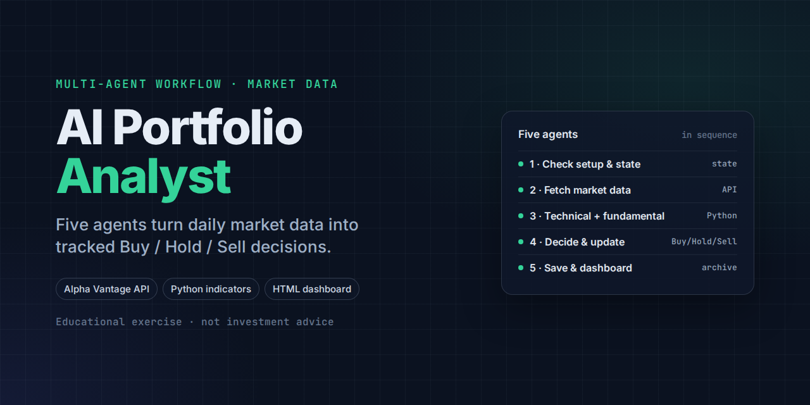

# AI Portfolio Analyst

A five-agent stock portfolio tracking workflow. Agents fetch market data, compute technical and fundamental indicators, combine them into a Buy/Hold/Sell decision, and log the result to a tracked spreadsheet and an HTML dashboard — all within a fixed API call budget.

**This is a classroom / educational exercise. Nothing produced by this system is investment advice.** Decisions, confidence scores, and rationale text are illustrative outputs of a learning project, not a recommendation to buy, hold, or sell any security. Always consult a licensed financial advisor before making investment decisions.

> **Companion project:** [stock-analyst-agent](https://github.com/garynair/stock-analyst-agent) tackles the same problem with live web research and a sentiment agent. This version runs on structured market data from the Alpha Vantage API, with Python doing the indicator math.

## How it works

Five agents, run in sequence:

| # | Role |
|---|------|
| 01 | Setup check and read previous state |
| 02 | Fetch market data (only agent allowed to call the API) |
| 03 | Technical + fundamental analysis (Python, cache only) |
| 04 | Decide (Buy/Hold/Sell) and update state |
| 05 | Save, archive, and build the dashboard |

Data source is Alpha Vantage (free tier, 25 calls/day). The workflow uses 20 calls per run across 10 tracked tickers (`TIME_SERIES_DAILY` + `OVERVIEW` per ticker), and reuses the day's cache if it already ran once — so a second run costs zero API calls.

## Structure

- `01_input/` — user-provided files (starter template, API key — see below)
- `02_output/` — generated portfolio state (raw API response caches are gitignored)
- `03_archive/` — superseded files (nothing is ever deleted, only archived with a timestamp)
- `04_dashboard/` — generated HTML dashboard
- `agents/` — the five agent instruction files

## Setup

All portfolio data in this repo is fictitious sample data.

You'll need your own Alpha Vantage API key (free tier works). Create `01_input/api_key.txt` containing only the key — this file is gitignored and never committed. See `CLAUDE.md` for the full workflow rules and the working spreadsheet's column layout.
